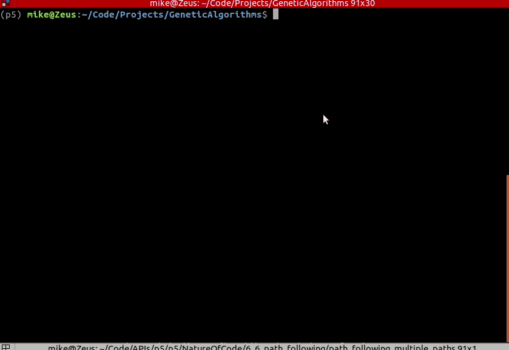

# GeneticAlgorithms

In this project I created a string guessing algorithm. My inspiration for the project came from a strong interest in evolution by natural selection, experience using genetic algorithms in MATLAB at university. I wanted to make a project to teach me Python, whilst exploring an area of computer science of particular interest to me. 

I replicated the project shown in this video series using . https://www.youtube.com/watch?v=9zfeTw-uFCw&list=PLRqwX-V7Uu6bJM3VgzjNV5YxVxUwzALHV&index=1

This was my very first python project. I used the techniques and knowledge known to me at the time, mostly  involving linked lists and strings, and wrote all the logic from scratch including the bubble sort algorithm. Some of the naming conventions are confusing as I wasn't aware at the time of the importance of well named variables in Python. I'd like to re-vistit this and change some variable names and get it all PEP8, but haven't yet. 

Briefly, a generation of models is randomly populated with guesses, then the guesses are evaluated, and the best guesses are allowed to 
spawn the next generations. In this way after many generations, the model improves and hopefully converges on an optimal result. 

The project interested me because I have an interest in evolution by natural selection, and in the mechanism of systems converging towards optimal solutions through the interaction of random noise and selection of the fittest. 

-------------------------------- Process --------------------------------

A string of any desired length is inputted by the user, then a genetic algorithm tries to guess the string which the user inputted. 

The algorithm populates a set of strings with random characters, then these strings are evaluated for fitness by comparing the characters in the guessed string with the characters in the user inputted string, and a percent fitness is recorded for each string. In each subsequent pass, a mixture of random mutation and gene inheritence from parents is iterated to allow convergence towards the user inputted word. 

EXAMPLE 1 - FIRST PASS:
User input: SPAM
Guessed strings: [SGFD, SFGM, GDDA, SDDR]
fitness scores: [25%, 50%, 0%, 25%] respectively
So we pick the word SFGM as the seed, because it is most similar to the target word SPAM.

In a contrived way, the algorithm doesn't get to see the user's guess, or the positions of correct letter guesses - all it gets is the fitness of each word. 

The fittest words from each generation are used to spawn the next - so in this case, SFGM would be used as the seed of the next generation's words. 

To make the next generation of words, letters are selected from the parent words to populate the child words. There are actually multiple parent words - so letters are picked from each parent. These shuffled seeds make up the children of the next generation. A random mutation is also allowed to happen to introduce diversity in the gene pool. Their fitnesses are re-evaluated and the ones with the closest match to the user inputted word are picked and used as the seeds of the next generation. 

EXAMPLE 2: ITERATION:
Strongest seed: SFGM
Next Generation: [TGFM, WFGM, SFAM, SFGT]
Fitness scores: [25%, 50%, 75%, 25%]

As in other processes involving random mutation, the fitness of the resulting words can either decrease or increase, and increasing fitness is less likely to happen than decreasing fitness. There was a sweet spot to find with the mutation rate - too much mutation, and the average fitness score dropped over time. Too little, and the gene pool doesn't contain enough variation to be able to increase its fitness. 

For example, if mutation rate = 0, and if the user input contains the letter X, and none of the initial seeds contain the letter X, then simple shuffling of the seeds will never yield a letter X. With random mutation however, the letter X can appear in any place in the string. 

The dynamics of convergence were interesting to play with, and I had control over a few parameters in the design of my model - the mutation rate, sizes of child populations, number of fittest seeds to pick from. I found that a high mutation rate drove the fitnesses down to zero, and that a low one resulted in stalling. 

MULTIPLE PARENTS:
I was able to pick letters from multiple parents to populate the next generation. Interestingly information could be contributed by any number of parents - not just two like in biology. I found this to be a useful technique of increasing convergence rate.

The algorithm iterates forever until 100% fitness is achieved.

to run:
python3 genetic.py 

Uses inheritance, selection and random mutation to guess a string inputted to the console by the user. 
Look in genetic.py to see parameters such as target string, number of parents per generation, 
number of children, mutation rate.

This was written on a climbing trip in Spain with very limited internet. 
The lack of online resources led me to write my own bubble sort algorithm to think through problems.

I intend to re-visit the project and clean up the variable names.

